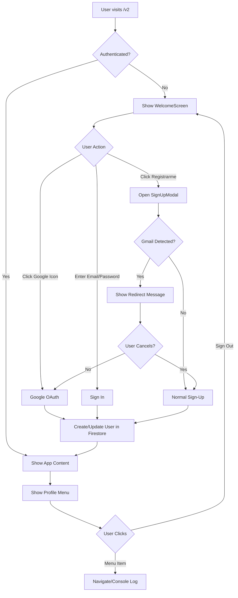

# Firebase Authentication Implementation Summary

## What Was Implemented

This implementation adds complete Firebase Authentication to your Postty v4.0 application with the following features:

### ✅ Core Features Implemented

#### 1. Firebase Integration
- Firebase SDK installed and configured
- Client-side Firebase initialization
- Environment-based configuration
- Firestore database integration

#### 2. Authentication Methods
- **Google OAuth** - One-click sign-in with Google account
- **Email/Password** - Traditional sign-up and sign-in
- **Gmail Detection** - Auto-redirects Gmail users to Google OAuth during sign-up
- **Secure Password Requirements**:
  - Minimum 8 characters
  - At least 1 uppercase letter
  - At least 1 number
  - At least 1 special character

#### 3. User Interface Components

##### Sign-Up Modal (`SignUpModal.tsx`)
- Beautiful glass-morphism design matching your site
- Real-time password validation with visual feedback
- Gmail detection with countdown timer
- Option to cancel Gmail redirect
- Google OAuth integration
- Error handling with toast notifications

##### Updated Welcome Screen (`WelcomeScreen.tsx`)
- Functional email/password sign-in form
- "Registrarme" button opens sign-up modal
- Google icon triggers Google OAuth
- Loading states during authentication
- Error handling with user-friendly messages

##### User Profile Menu (`UserProfileMenu.tsx`)
- Circular avatar button in top-right corner
- Displays Google profile photo or gradient placeholder with initials
- Dropdown menu with:
  - User name and email
  - "Mis referencias" (placeholder route)
  - "Mi marca" (placeholder route)
  - "Mis posts" (placeholder route)
  - "Cerrar sesión" (Sign out)
- Click outside to close
- Glass-morphism styling

#### 4. Authentication Context (`AuthContext.tsx`)
- Global auth state management
- Monitors Firebase auth state changes
- Loads user profile from Firestore
- Provides `useAuth()` hook for components
- Handles sign-out functionality

#### 5. Route Protection
- Auth state checking on app load
- Loading spinner while checking authentication
- Redirects unauthenticated users to welcome screen
- Protects all routes after step 1
- Persists auth state across page refreshes

#### 6. Firestore Integration
- Automatic user profile creation on sign-up
- User data structure:
  ```typescript
  {
    email: string
    displayName: string | null
    photoURL: string | null
    provider: 'google' | 'email'
    createdAt: timestamp
    references: []  // placeholder for future
    brand: {}       // placeholder for future
    posts: []       // placeholder for future
  }
  ```
- Security rules to protect user data

## File Structure

```
frontend/
├── .env.example                    # Environment variables template
├── .env.local                      # Your Firebase credentials (create this)
├── FIREBASE_SETUP.md              # Setup instructions
├── AUTHENTICATION_IMPLEMENTATION.md # This file
└── src/
    ├── lib/
    │   └── firebase/
    │       ├── config.ts          # Firebase initialization
    │       ├── auth.ts            # Auth helper functions
    │       └── firestore.ts       # Firestore helper functions
    ├── contexts/
    │   └── AuthContext.tsx        # Auth state management
    ├── app/
    │   ├── providers.tsx          # Updated with AuthProvider
    │   └── v2/
    │       ├── page.tsx           # Updated with route protection
    │       └── _components/
    │           ├── WelcomeScreen.tsx      # Updated with auth
    │           ├── SignUpModal.tsx        # New sign-up modal
    │           └── ui/
    │               └── UserProfileMenu.tsx # New profile menu
```

## How It Works

### Authentication Flow



### Gmail Detection Flow

1. User types email in sign-up modal
2. After 500ms debounce, check if email ends with `@gmail.com`
3. If Gmail detected:
   - Show blue overlay message
   - Start 3-second countdown
   - Auto-redirect to Google OAuth
   - User can cancel to continue with password
4. If not Gmail:
   - Continue with normal sign-up flow

### Password Validation

Real-time validation with visual indicators:
- ✓ Green checkmark = requirement met
- ✗ Gray/red X = requirement not met
- Submit button disabled until all requirements met

## Design System Consistency

All components follow your existing design language:

- **Glass Morphism**: Semi-transparent backgrounds with backdrop blur
- **Rounded Corners**: Large border radius (20-28px) for cards and buttons
- **Gradient Buttons**: Sky/cyan/emerald gradient for primary actions
- **Color Palette**: Matches existing radial gradient background
- **Typography**: Consistent font weights and sizes
- **Shadows**: Soft, elevated shadows
- **Transitions**: Smooth 200ms transitions

## Security Features

✅ **Implemented:**
- Firebase Authentication security
- Firestore security rules (user can only access own data)
- Environment variables for sensitive credentials
- Password strength validation
- HTTPS-only in production (Firebase default)

🔒 **Recommended for Production:**
- Email verification before full access
- Rate limiting on authentication attempts
- Password reset flow
- Two-factor authentication
- Regular security audits

## Next Steps

### Immediate (Setup)
1. Follow `FIREBASE_SETUP.md` to configure Firebase
2. Create `.env.local` with your credentials
3. Test authentication flows

### Short Term (Features)
1. Implement "My references" page
2. Implement "My brand" page
3. Implement "My posts" page
4. Add password reset functionality
5. Add email verification

### Long Term (Enhancements)
1. Profile editing
2. Account settings page
3. Social media integrations
4. Advanced security features
5. Analytics and monitoring

## Testing Checklist

- [ ] Google OAuth sign-in creates user in Firestore
- [ ] Email/password sign-up with valid password works
- [ ] Email/password sign-in works
- [ ] Gmail detection redirects to Google OAuth
- [ ] Can cancel Gmail redirect
- [ ] Password validation shows real-time feedback
- [ ] Invalid passwords are rejected
- [ ] User avatar displays Google photo or placeholder
- [ ] Profile menu opens/closes correctly
- [ ] Menu items log to console (placeholders)
- [ ] Sign out clears auth state and returns to step 1
- [ ] Auth state persists across page refreshes
- [ ] Protected routes redirect unauthenticated users
- [ ] Loading spinner shows while checking auth
- [ ] Error messages are user-friendly

## Known Limitations

1. **Placeholder Routes**: "My references", "My brand", and "My posts" currently log to console
2. **No Password Reset**: Users cannot reset forgotten passwords yet
3. **No Email Verification**: Email addresses are not verified
4. **No Profile Editing**: Users cannot change their name or photo (except Google users via Google)

## API Reference

### Hooks

#### `useAuth()`
```typescript
const { user, userProfile, loading, signOut } = useAuth();
```
- `user`: Firebase User object or null
- `userProfile`: UserProfile from Firestore or null
- `loading`: Boolean indicating if auth state is loading
- `signOut`: Function to sign out current user

### Functions

#### `signInWithGoogle()`
```typescript
import { signInWithGoogle } from '@/lib/firebase/auth';
const result = await signInWithGoogle();
```

#### `signUpWithEmail(email, password, displayName?)`
```typescript
import { signUpWithEmail } from '@/lib/firebase/auth';
const result = await signUpWithEmail('user@example.com', 'Password123!', 'John Doe');
```

#### `signInWithEmail(email, password)`
```typescript
import { signInWithEmail } from '@/lib/firebase/auth';
const result = await signInWithEmail('user@example.com', 'Password123!');
```

#### `validatePassword(password)`
```typescript
import { validatePassword } from '@/lib/firebase/auth';
const { isValid, checks } = validatePassword('Password123!');
```

#### `isGmailAddress(email)`
```typescript
import { isGmailAddress } from '@/lib/firebase/auth';
const isGmail = isGmailAddress('user@gmail.com'); // true
```

## Support

If you need help:
1. Check `FIREBASE_SETUP.md` for setup instructions
2. Review browser console for errors
3. Check Firebase Console for auth/database issues
4. Review Firebase documentation

---

**Implementation completed successfully!** 🎉

Ready to configure Firebase and start using authentication.

